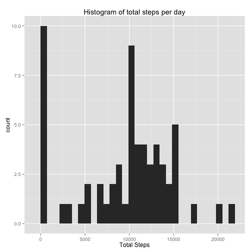
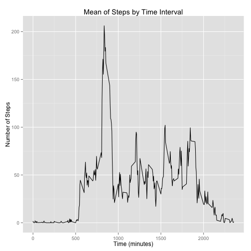
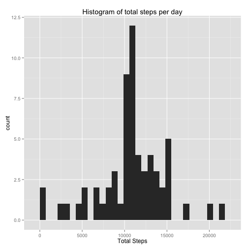
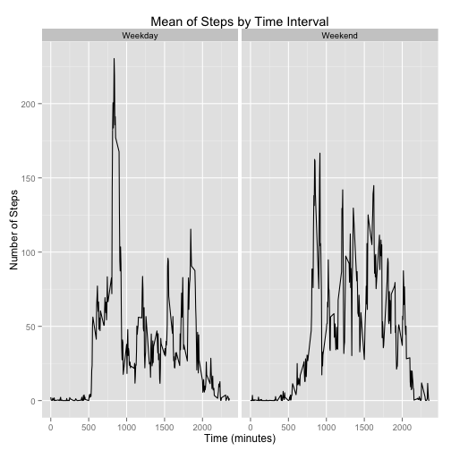

**Read in and preprocess the data**, I'm going to tell R to NOT factor the dates and instead use lubridate to convert them to POSIXct format:


```r
library(lubridate)
activity<-read.csv('activity.csv', stringsAsFactors = FALSE)
activity$date<-ymd(activity$date)
str(activity)
```

```
## 'data.frame':	17568 obs. of  3 variables:
##  $ steps   : int  NA NA NA NA NA NA NA NA NA NA ...
##  $ date    : POSIXct, format: "2012-10-01" "2012-10-01" ...
##  $ interval: int  0 5 10 15 20 25 30 35 40 45 ...
```

**What is mean total number of steps taken per day?**
Let's grab the means, medians, and total for the steps at each date using dplyr:


```r
library(dplyr)
```

```
## 
## Attaching package: 'dplyr'
## 
## The following objects are masked from 'package:lubridate':
## 
##     intersect, setdiff, union
## 
## The following object is masked from 'package:stats':
## 
##     filter
## 
## The following objects are masked from 'package:base':
## 
##     intersect, setdiff, setequal, union
```

```r
library(ggplot2)
activity.tbl<-tbl_df(activity)
mns<-activity.tbl%>%
    group_by(date)%>%
    summarize(mn = mean(steps, na.rm = TRUE))
mdns<-activity.tbl%>%
    group_by(date)%>%
    summarize(mdn = median(steps, na.rm = TRUE))
total<-activity.tbl%>%
    group_by(date)%>%
    summarize(totalSteps = sum(steps, na.rm = TRUE))
mns
```

```
## Source: local data frame [61 x 2]
## 
##          date         mn
## 1  2012-10-01        NaN
## 2  2012-10-02  0.4375000
## 3  2012-10-03 39.4166667
## 4  2012-10-04 42.0694444
## 5  2012-10-05 46.1597222
## 6  2012-10-06 53.5416667
## 7  2012-10-07 38.2465278
## 8  2012-10-08        NaN
## 9  2012-10-09 44.4826389
## 10 2012-10-10 34.3750000
## 11 2012-10-11 35.7777778
## 12 2012-10-12 60.3541667
## 13 2012-10-13 43.1458333
## 14 2012-10-14 52.4236111
## 15 2012-10-15 35.2048611
## 16 2012-10-16 52.3750000
## 17 2012-10-17 46.7083333
## 18 2012-10-18 34.9166667
## 19 2012-10-19 41.0729167
## 20 2012-10-20 36.0937500
## 21 2012-10-21 30.6284722
## 22 2012-10-22 46.7361111
## 23 2012-10-23 30.9652778
## 24 2012-10-24 29.0104167
## 25 2012-10-25  8.6527778
## 26 2012-10-26 23.5347222
## 27 2012-10-27 35.1354167
## 28 2012-10-28 39.7847222
## 29 2012-10-29 17.4236111
## 30 2012-10-30 34.0937500
## 31 2012-10-31 53.5208333
## 32 2012-11-01        NaN
## 33 2012-11-02 36.8055556
## 34 2012-11-03 36.7048611
## 35 2012-11-04        NaN
## 36 2012-11-05 36.2465278
## 37 2012-11-06 28.9375000
## 38 2012-11-07 44.7326389
## 39 2012-11-08 11.1770833
## 40 2012-11-09        NaN
## 41 2012-11-10        NaN
## 42 2012-11-11 43.7777778
## 43 2012-11-12 37.3784722
## 44 2012-11-13 25.4722222
## 45 2012-11-14        NaN
## 46 2012-11-15  0.1423611
## 47 2012-11-16 18.8923611
## 48 2012-11-17 49.7881944
## 49 2012-11-18 52.4652778
## 50 2012-11-19 30.6979167
## 51 2012-11-20 15.5277778
## 52 2012-11-21 44.3993056
## 53 2012-11-22 70.9270833
## 54 2012-11-23 73.5902778
## 55 2012-11-24 50.2708333
## 56 2012-11-25 41.0902778
## 57 2012-11-26 38.7569444
## 58 2012-11-27 47.3819444
## 59 2012-11-28 35.3576389
## 60 2012-11-29 24.4687500
## 61 2012-11-30        NaN
```

```r
mdns
```

```
## Source: local data frame [61 x 2]
## 
##          date mdn
## 1  2012-10-01  NA
## 2  2012-10-02   0
## 3  2012-10-03   0
## 4  2012-10-04   0
## 5  2012-10-05   0
## 6  2012-10-06   0
## 7  2012-10-07   0
## 8  2012-10-08  NA
## 9  2012-10-09   0
## 10 2012-10-10   0
## 11 2012-10-11   0
## 12 2012-10-12   0
## 13 2012-10-13   0
## 14 2012-10-14   0
## 15 2012-10-15   0
## 16 2012-10-16   0
## 17 2012-10-17   0
## 18 2012-10-18   0
## 19 2012-10-19   0
## 20 2012-10-20   0
## 21 2012-10-21   0
## 22 2012-10-22   0
## 23 2012-10-23   0
## 24 2012-10-24   0
## 25 2012-10-25   0
## 26 2012-10-26   0
## 27 2012-10-27   0
## 28 2012-10-28   0
## 29 2012-10-29   0
## 30 2012-10-30   0
## 31 2012-10-31   0
## 32 2012-11-01  NA
## 33 2012-11-02   0
## 34 2012-11-03   0
## 35 2012-11-04  NA
## 36 2012-11-05   0
## 37 2012-11-06   0
## 38 2012-11-07   0
## 39 2012-11-08   0
## 40 2012-11-09  NA
## 41 2012-11-10  NA
## 42 2012-11-11   0
## 43 2012-11-12   0
## 44 2012-11-13   0
## 45 2012-11-14  NA
## 46 2012-11-15   0
## 47 2012-11-16   0
## 48 2012-11-17   0
## 49 2012-11-18   0
## 50 2012-11-19   0
## 51 2012-11-20   0
## 52 2012-11-21   0
## 53 2012-11-22   0
## 54 2012-11-23   0
## 55 2012-11-24   0
## 56 2012-11-25   0
## 57 2012-11-26   0
## 58 2012-11-27   0
## 59 2012-11-28   0
## 60 2012-11-29   0
## 61 2012-11-30  NA
```

```r
qplot(total$totalSteps, geom="histogram", main = "Histogram of total steps per day", xlab = "Total Steps")
```

```
## stat_bin: binwidth defaulted to range/30. Use 'binwidth = x' to adjust this.
```

 

**What is the average daily activity pattern?**
Now let's again use dplyr to grab the average steps across days by 5-minute interval and plot it:


```r
meanByInterval<-activity.tbl%>%
    group_by(interval)%>%
    summarize(meanSteps = mean(steps, na.rm = TRUE))
qplot(meanByInterval$interval, meanByInterval$meanSteps, geom = "line", main = "Mean of Steps by Time Interval", xlab = "Time (minutes)", ylab = "Number of Steps")
```

 

```r
##Get the interval wth the maximum number of average steps
meanByInterval$interval[meanByInterval$meanSteps == max(meanByInterval$meanSteps)]
```

```
## [1] 835
```

**Imputing missing values**
First we'll get the number of missing step counts, then fill in each missing value with the average value for that interval across days. The same code from above can be used to compute the summary statistics.


```r
#number of missing vals
length(activity[,1][is.na(activity[,1])])
```

```
## [1] 2304
```

```r
#make activity2, will be the same as activity to start
activity2<-activity
for (i in 1:length(activity2[,1])){
    #if  value X is NA, look up the mean value for that interval and set X to it
    if (is.na(activity2[i,1])){
        interv<-activity2[i,3]
        meanVal<-meanByInterval$meanSteps[meanByInterval$interval==interv]
        activity2[i,1]<-meanVal
    }
}
#Using the same code from above to calculate summary statistics
activity2.tbl<-tbl_df(activity2)
mns2<-activity2.tbl%>%
    group_by(date)%>%
    summarize(mn = mean(steps, na.rm = TRUE))
mdns2<-activity2.tbl%>%
    group_by(date)%>%
    summarize(mdn = median(steps, na.rm = TRUE))
total2<-activity2.tbl%>%
    group_by(date)%>%
    summarize(totalSteps = sum(steps, na.rm = TRUE))
mns2
```

```
## Source: local data frame [61 x 2]
## 
##          date         mn
## 1  2012-10-01 37.3825996
## 2  2012-10-02  0.4375000
## 3  2012-10-03 39.4166667
## 4  2012-10-04 42.0694444
## 5  2012-10-05 46.1597222
## 6  2012-10-06 53.5416667
## 7  2012-10-07 38.2465278
## 8  2012-10-08 37.3825996
## 9  2012-10-09 44.4826389
## 10 2012-10-10 34.3750000
## 11 2012-10-11 35.7777778
## 12 2012-10-12 60.3541667
## 13 2012-10-13 43.1458333
## 14 2012-10-14 52.4236111
## 15 2012-10-15 35.2048611
## 16 2012-10-16 52.3750000
## 17 2012-10-17 46.7083333
## 18 2012-10-18 34.9166667
## 19 2012-10-19 41.0729167
## 20 2012-10-20 36.0937500
## 21 2012-10-21 30.6284722
## 22 2012-10-22 46.7361111
## 23 2012-10-23 30.9652778
## 24 2012-10-24 29.0104167
## 25 2012-10-25  8.6527778
## 26 2012-10-26 23.5347222
## 27 2012-10-27 35.1354167
## 28 2012-10-28 39.7847222
## 29 2012-10-29 17.4236111
## 30 2012-10-30 34.0937500
## 31 2012-10-31 53.5208333
## 32 2012-11-01 37.3825996
## 33 2012-11-02 36.8055556
## 34 2012-11-03 36.7048611
## 35 2012-11-04 37.3825996
## 36 2012-11-05 36.2465278
## 37 2012-11-06 28.9375000
## 38 2012-11-07 44.7326389
## 39 2012-11-08 11.1770833
## 40 2012-11-09 37.3825996
## 41 2012-11-10 37.3825996
## 42 2012-11-11 43.7777778
## 43 2012-11-12 37.3784722
## 44 2012-11-13 25.4722222
## 45 2012-11-14 37.3825996
## 46 2012-11-15  0.1423611
## 47 2012-11-16 18.8923611
## 48 2012-11-17 49.7881944
## 49 2012-11-18 52.4652778
## 50 2012-11-19 30.6979167
## 51 2012-11-20 15.5277778
## 52 2012-11-21 44.3993056
## 53 2012-11-22 70.9270833
## 54 2012-11-23 73.5902778
## 55 2012-11-24 50.2708333
## 56 2012-11-25 41.0902778
## 57 2012-11-26 38.7569444
## 58 2012-11-27 47.3819444
## 59 2012-11-28 35.3576389
## 60 2012-11-29 24.4687500
## 61 2012-11-30 37.3825996
```

```r
mdns2
```

```
## Source: local data frame [61 x 2]
## 
##          date      mdn
## 1  2012-10-01 34.11321
## 2  2012-10-02  0.00000
## 3  2012-10-03  0.00000
## 4  2012-10-04  0.00000
## 5  2012-10-05  0.00000
## 6  2012-10-06  0.00000
## 7  2012-10-07  0.00000
## 8  2012-10-08 34.11321
## 9  2012-10-09  0.00000
## 10 2012-10-10  0.00000
## 11 2012-10-11  0.00000
## 12 2012-10-12  0.00000
## 13 2012-10-13  0.00000
## 14 2012-10-14  0.00000
## 15 2012-10-15  0.00000
## 16 2012-10-16  0.00000
## 17 2012-10-17  0.00000
## 18 2012-10-18  0.00000
## 19 2012-10-19  0.00000
## 20 2012-10-20  0.00000
## 21 2012-10-21  0.00000
## 22 2012-10-22  0.00000
## 23 2012-10-23  0.00000
## 24 2012-10-24  0.00000
## 25 2012-10-25  0.00000
## 26 2012-10-26  0.00000
## 27 2012-10-27  0.00000
## 28 2012-10-28  0.00000
## 29 2012-10-29  0.00000
## 30 2012-10-30  0.00000
## 31 2012-10-31  0.00000
## 32 2012-11-01 34.11321
## 33 2012-11-02  0.00000
## 34 2012-11-03  0.00000
## 35 2012-11-04 34.11321
## 36 2012-11-05  0.00000
## 37 2012-11-06  0.00000
## 38 2012-11-07  0.00000
## 39 2012-11-08  0.00000
## 40 2012-11-09 34.11321
## 41 2012-11-10 34.11321
## 42 2012-11-11  0.00000
## 43 2012-11-12  0.00000
## 44 2012-11-13  0.00000
## 45 2012-11-14 34.11321
## 46 2012-11-15  0.00000
## 47 2012-11-16  0.00000
## 48 2012-11-17  0.00000
## 49 2012-11-18  0.00000
## 50 2012-11-19  0.00000
## 51 2012-11-20  0.00000
## 52 2012-11-21  0.00000
## 53 2012-11-22  0.00000
## 54 2012-11-23  0.00000
## 55 2012-11-24  0.00000
## 56 2012-11-25  0.00000
## 57 2012-11-26  0.00000
## 58 2012-11-27  0.00000
## 59 2012-11-28  0.00000
## 60 2012-11-29  0.00000
## 61 2012-11-30 34.11321
```

```r
qplot(total2$totalSteps, geom="histogram", main = "Histogram of total steps per day", xlab = "Total Steps")
```

```
## stat_bin: binwidth defaulted to range/30. Use 'binwidth = x' to adjust this.
```

 

**Are there differences in activity patterns between weekdays and weekends?**

For this, we'll define a funciton that takes in day names and tells us if it's a weekend or weekday, then we'll use the same code from above to take the mean steps by interval, and plot the time series graphs using ggplot, faceting by weekend/weekday


```r
isWeekend<-function(day){
    if (day=="Saturday" | day=="Sunday"){
        day <- "Weekend"
    }
    else{
        day <- "Weekday"
    }
}
#apply the weekdays function to get day names, then isWeekend function
activity2$day<-sapply(activity2$date, weekdays)
activity2$day<-sapply(activity2$day, isWeekend)
activity2$day<-factor(activity2$day)

activity2.tbl<-tbl_df(activity2)
meanByInterval2<-activity2.tbl%>%
    group_by(interval, day)%>%
    summarize(meanSteps = mean(steps))
qplot(data = meanByInterval2, x = interval, y = meanSteps, facets = .~day, geom = "line", main = "Mean of Steps by Time Interval", xlab = "Time (minutes)", ylab = "Number of Steps")
```

 

The graph for weekday shows a definite peak around 800 minutes, perhaps due to a walk to work or something of the like, the weekend graph also has a peak around that time, bu not significantly higher than the other peaks throughout the day
